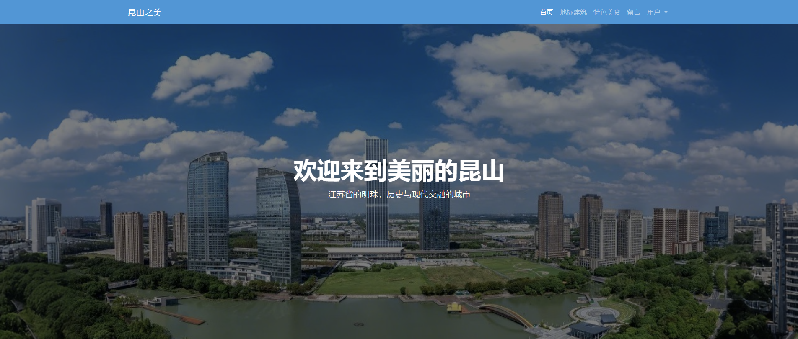
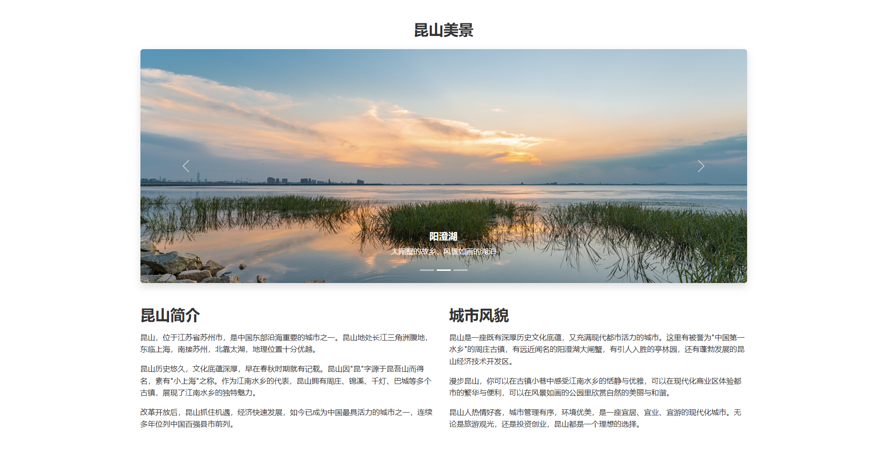
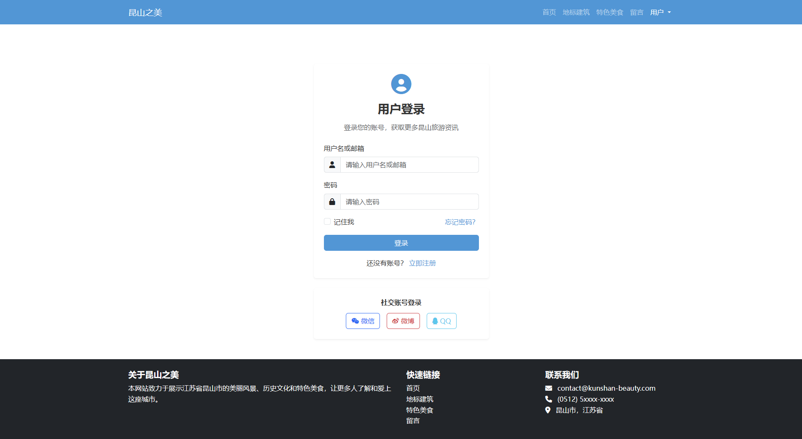

# 昆山之美 - 响应式静态网站

一个旨在通过现代网页技术，全方位展示中国江苏省昆山市风土人情的响应式静态网站。项目深度融合了昆山的历史底蕴与现代活力，从地标建筑到特色美食，为访问者提供了一次沉浸式的线上"昆山之旅"。

## ✨ 核心功能

*   **全响应式设计**: 基于 **Bootstrap** 网格系统构建，从大尺寸桌面显示器到小型移动设备，网站都能自适应调整布局，提供无缝的视觉体验。
*   **丰富的多页面体验**:
    *   **首页 (`index.html`)**: 网站的门户，包含引人入胜的城市简介、导航菜单和展示昆山风光的 **Bootstrap 轮播图**。
    *   **地标建筑 (`landmarks.html`)**: 使用 **Bootstrap 卡片**组件，图文并茂地介绍周庄、亭林园等昆山著名地标。
    *   **特色美食 (`food.html`)**: 通过精心设计的图文布局，展示奥灶面、阳澄湖大闸蟹等地道美食的魅力。
    *   **互动留言板 (`feedback.html`)**: 用户可以通过表单留下建议。表单集成了基于 **JavaScript/jQuery** 的前端验证，并使用 **Ajax** 模拟异步提交过程，提升了用户交互的流畅度。
    *   **用户中心 (`login.html` & `register.html`)**: 提供了模拟的用户登录与注册界面，展示了完整的表单构建与验证流程。
*   **流畅的交互动画**: 运用 CSS3 和 jQuery，为网站增添了平滑的过渡效果和动态交互，使浏览过程更加生动有趣。

## 📂 项目结构

```
kunshan-website/
│
├── css/
│   └── style.css           # 自定义样式表
│
├── js/
│   └── script.js           # 自定义JavaScript脚本 (如果需要)
│
├── index.html              # 网站首页
├── landmarks.html          # 地标建筑页面
├── food.html               # 特色美食页面
├── feedback.html           # 留言板页面
├── login.html              # 登录页面
└── register.html           # 注册页面
```

## 🛠️ 技术栈解析

*   **HTML5**: 作为网站的骨架，负责构建所有页面的基本结构和内容。
*   **CSS3**: 用于美化网站，包括布局、颜色、字体以及 `hover` 等伪类动画效果。
*   **JavaScript**: 赋予网站生命，处理复杂的交互逻辑，如表单验证、DOM 操作等。
*   **jQuery**: 简化了 JavaScript 代码，尤其是事件处理和 Ajax 操作，提高了开发效率。
*   **Ajax**: 在留言板等处模拟了与服务器的异步通信，实现了无需刷新页面的数据提交，优化了用户体验。
*   **Bootstrap**: 作为核心响应式框架，提供了网格系统、轮播图、卡片、表单等预制组件，极大地加快了开发速度并保证了跨设备兼容性。

## 🚀 快速开始

该项目为纯静态网站，无需复杂的后端配置。

1.  **克隆仓库**
    ```bash
    git clone https://github.com/your-username/kunshan-website.git
    ```
2.  **打开文件**
    直接在你的浏览器中打开 `index.html` 文件即可开始浏览。

    或者，你也可以使用一个简单的本地服务器来运行，这能更好地模拟线上环境：
    ```bash
    # 如果你安装了 Python 3
    python -m http.server

    # 或者使用 Node.js 的 http-server
    npm install -g http-server
    http-server
    ```

## ⚠️ 注意事项

*   **纯前端项目**: 本项目不包含任何后端逻辑。留言、登录和注册功能均为前端模拟，数据不会被真实保存。
*   **本地图片**: 项目中的图片资源需要存放在 `images` 文件夹下，并确保其路径与 HTML 代码中的引用一致。

## 📸 网站截图






## 浏览器兼容性

本网站在以下浏览器中测试通过：

- Google Chrome (最新版)
- Mozilla Firefox (最新版)
- Microsoft Edge (最新版)
- Safari (最新版)

## 注意事项

- 这是一个静态网站，不包含后端功能。所有表单提交和用户验证都是模拟的。
- 网站中的图片需要自行添加到`images`文件夹下，并根据HTML文件中的图片路径命名。
- 网站设计采用响应式布局，适合在不同设备上浏览。